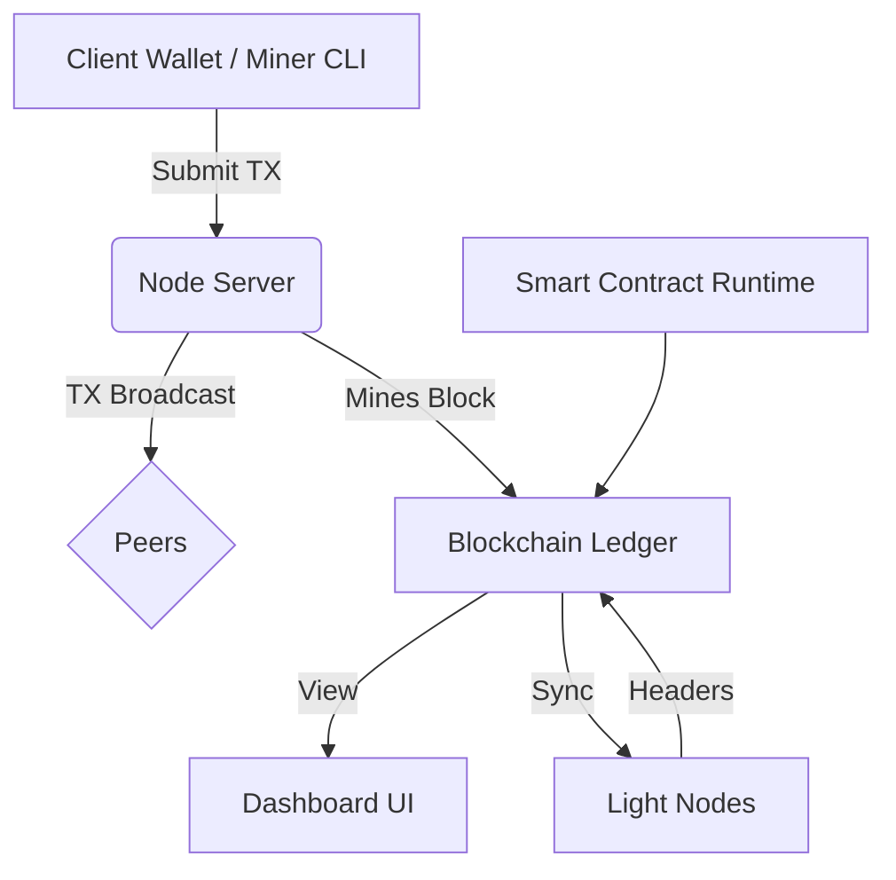

# Bitcode Blockchain Architecture

## Modules
- `chain.rs`: Core blockchain data structure, mining, transaction validation
- `wallet.rs`: Key generation and transaction signing
- `node.rs`: Peer-to-peer logic, HTTP and dashboard server
- `contract.rs`: WASM contract engine (Wasmer)

## Flow
1. Wallet signs and submits TX via CLI or Dashboard
2. Node verifies and rebroadcasts TX
3. Miner mines block with TXs, adds to chain
4. Chain syncs across nodes
5. Smart contracts can be executed during TX processing

---

# Future Plans
- Bitcode-20 / Bitcode-721 Token Standards
- Snapshot Explorer
- Faucet & Airdrop Bot
- Wallet QR Signing App
- IPFS Integration
