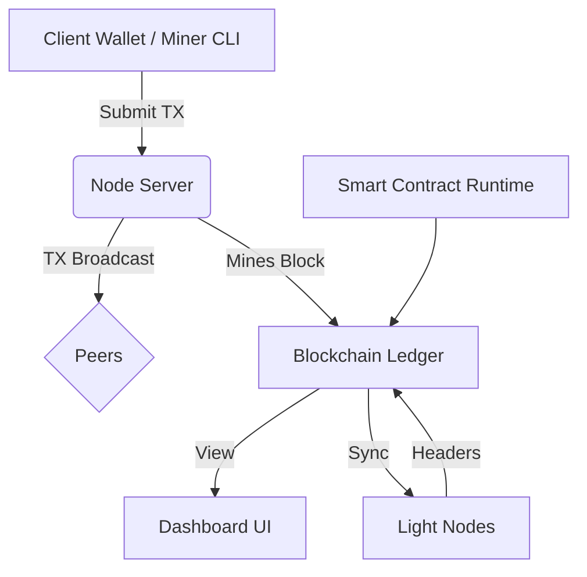

# Bitcode Blockchain Architecture

```mermaid
graph TD
  A[Client Wallet / Miner CLI] -->|Submit TX| B(Node Server)
  B -->|TX Broadcast| C{Peers}
  B -->|Mines Block| D[Blockchain Ledger]
  D -->|View| E[Dashboard UI]
  F[Smart Contract Runtime] --> D
  D -->|Sync| G[Light Nodes]
  G -->|Headers| D
```
